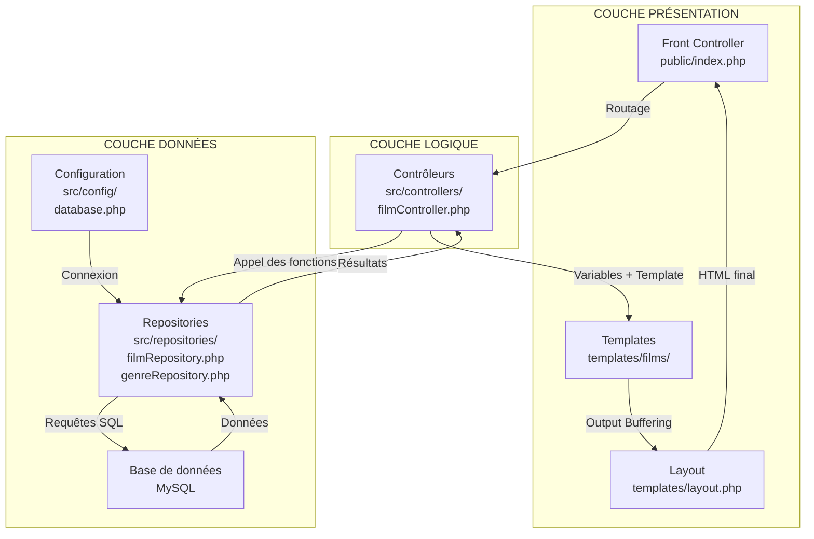

# Gestion des Films - Architecture MVC Simple

Ce projet présente une architecture MVC simple pour la gestion d'une base de données de films, conçue pour l'enseignement en BTS SIO.

## Architecture du Projet

```
docker-php/
├── docker/                    # Configuration Docker
│   └── db/
│       └── init.sql          # Script d'initialisation de la base de données
├── public/                    # Point d'entrée web
│   ├── index.php             # Front Controller
│   └── .htaccess             # Configuration Apache
├── src/                      # Code source de l'application
│   ├── config/
│   │   └── database.php      # Configuration de la base de données
│   ├── controllers/
│   │   └── filmController.php # Contrôleur pour les films
│   └── repositories/         # Repositories (un par table)
│       ├── filmRepository.php # Repository pour les films
│       └── genreRepository.php # Repository pour les genres
├── templates/                 # Vues (templates)
│   ├── layout.php            # Template de base
│   └── films/                # Vues spécifiques aux films
│       ├── index.php         # Liste des films
│       ├── show.php          # Détails d'un film
│       ├── create.php        # Formulaire de création
│       └── edit.php          # Formulaire de modification
├── docker-compose.yml        # Configuration Docker Compose
├── ARCHITECTURE.md           # Documentation de l'architecture
├── REFACTORING.md            # Documentation du refactoring
└── README.md                 # Ce fichier
```

## Fonctionnalités

- **CRUD complet** : Création, lecture, mise à jour et suppression de films
- **Recherche** : Recherche par titre ou réalisateur
- **Validation** : Validation des données côté serveur avec pré-remplissage
- **Interface responsive** : Design adaptatif et moderne
- **Gestion des erreurs** : Système de messages via sessions (erreurs/succès)
- **Architecture unifiée** : GET pour afficher, POST pour traiter
- **Sécurité** : Protection XSS et gestion sécurisée des paramètres
- **UX optimisée** : Redirections intelligentes avec messages persistants

## Technologies Utilisées

- **PHP 8.4** : Langage de programmation (sans POO, uniquement des fonctions)
- **MySQL 8.4** : Base de données
- **Docker** : Conteneurisation
- **HTML/CSS** : Interface utilisateur
- **PDO** : Accès à la base de données

## Installation et Utilisation

### 1. Démarrer les conteneurs Docker

```bash
docker-compose up -d
```

### 2. Accéder à l'application

- **Application web** : http://localhost:8001 (serveur PHP interne)
- **phpMyAdmin** : http://localhost:8010

### 3. Configuration de la base de données

La base de données est automatiquement initialisée avec :
- Table `genres` : 10 genres de films
- Table `films` : 30 films d'exemple avec données réalistes

## Architecture MVC

### Vue d'ensemble de l'architecture MVC

L'architecture MVC (Model-View-Controller) sépare l'application en trois couches distinctes :

```
┌─────────────────────────────────────────────────────────────┐
│                    COUCHE PRÉSENTATION                      │
│  ┌─────────────────┐  ┌─────────────────┐  ┌─────────────┐  │
│  │   Frontend      │  │   Templates     │  │   Layout    │  │
│  │   (index.php)   │  │   (Vues)        │  │   (layout)  │  │
│  └─────────────────┘  └─────────────────┘  └─────────────┘  │
└─────────────────────────────────────────────────────────────┘
┌─────────────────────────────────────────────────────────────┐
│                    COUCHE LOGIQUE                           │
│  ┌────────────────────────────────────────────────────────┐ │
│  │              Contrôleurs (filmController.php)          │ │
│  │  • Logique métier • Validation • Orchestration         │ │
│  └────────────────────────────────────────────────────────┘ │
└─────────────────────────────────────────────────────────────┘
┌─────────────────────────────────────────────────────────────┐
│                    COUCHE DONNÉES                           │
│  ┌─────────────────┐  ┌─────────────────┐  ┌─────────────┐  │
│  │  Repositories   │  │   Configuration │  │   Base de   │  │
│  │  (film, genre)  │  │   (database.php)│  │   données   │  │
│  └─────────────────┘  └─────────────────┘  └─────────────┘  │
└─────────────────────────────────────────────────────────────┘
```

### Rôle des composants MVC

#### 🎯 **Modèle (Model) - Couche Données**

**Rôle** : Gestion des données et accès à la base de données

**Composants** :
- **Repositories** (`src/repositories/`) : Interface entre l'application et la base de données
  - `filmRepository.php` : Gestion des films uniquement
  - `genreRepository.php` : Gestion des genres uniquement
- **Configuration** (`src/config/database.php`) : Connexion à la base de données

**Responsabilités** :
- ✅ Accès aux données (CRUD)
- ✅ Requêtes SQL optimisées
- ✅ Gestion des erreurs de base de données
- ✅ Séparation par entité (un repository = une table)
- ✅ Retour de `false` en cas d'erreur pour gestion centralisée

**Exemple de fonction** :
```php
function getAllFilms() {
    $pdo = getDatabaseConnection();
    $sql = "SELECT f.*, g.nom as genre_nom FROM films f JOIN genres g ON f.genre_id = g.id";
    return $pdo->query($sql)->fetchAll();
}
```

#### 🎮 **Contrôleur (Controller) - Couche Logique**

**Rôle** : Orchestration, logique métier et validation

**Composants** :
- **Front Controller** (`public/index.php`) : Point d'entrée unique, routage des requêtes
- **Contrôleurs métier** (`src/controllers/filmController.php`) : Logique spécifique aux films

**Responsabilités** :
- ✅ Routage des requêtes (action → fonction)
- ✅ Validation des données
- ✅ Logique métier et règles de gestion
- ✅ Orchestration Modèle ↔ Vue
- ✅ Gestion des erreurs et messages via sessions
- ✅ Récupération et validation des paramètres de requête
- ✅ Redirections intelligentes avec messages persistants

**Exemple de fonction** :
```php
function createFilm() {
    $genres = getAllGenres(); // Appel du Modèle
    $errors = validateFilmData($_POST); // Logique métier
    
    if (empty($errors)) {
        createFilmData($_POST); // Appel du Modèle
        header("Location: index.php?action=index");
    }
    
    include 'templates/films/create.php'; // Appel de la Vue
}
```

#### 🖼️ **Vue (View) - Couche Présentation**

**Rôle** : Affichage des données et interface utilisateur

**Composants** :
- **Layout** (`templates/layout.php`) : Template de base commun
- **Vues spécifiques** (`templates/films/`) : Templates pour chaque action

**Responsabilités** :
- ✅ Affichage des données
- ✅ Interface utilisateur (formulaires, tableaux)
- ✅ Gestion de l'output buffering
- ✅ Séparation contenu/layout

**Exemple de structure** :
```php
<?php
$title = 'Liste des Films';
ob_start(); // Démarrage du buffer
?>
<div class="card">
    <!-- Contenu HTML de la vue -->
</div>
<?php
$content = ob_get_clean(); // Récupération du contenu
include __DIR__ . '/../layout.php'; // Inclusion du layout
?>
```

### 🔄 Schéma de l'architecture MVC



### 📋 Étapes détaillées du traitement

#### 1. **Réception de la requête**
```
URL: index.php?action=create
Méthode: POST
Données: {titre: "Nouveau Film", realisateur: "John Doe", ...}
```

#### 2. **Routage (Front Controller)**
```php
$action = $_GET['action'] ?? 'index';
switch ($action) {
    case 'create':
        createFilm(); // Appel du contrôleur
        break;
}
```

#### 3. **Traitement (Contrôleur)**
```php
function createFilm() {
    // 1. Récupération des données nécessaires
    $genres = getAllGenres(); // Appel du Modèle
    
    // 2. Détection de la soumission
    if ($_SERVER['REQUEST_METHOD'] === 'POST') {
        // 3. Validation
        $errors = validateFilmData($_POST);
        
        if (empty($errors)) {
            // 4. Sauvegarde
            createFilmData($_POST); // Appel du Modèle
            header("Location: index.php?action=index");
        } else {
            // 5. Pré-remplissage en cas d'erreur
            $film = $_POST;
        }
    }
    
    // 6. Affichage
    include 'templates/films/create.php'; // Appel de la Vue
}
```

#### 4. **Accès aux données (Modèle)**
```php
function createFilmData($data) {
    $pdo = getDatabaseConnection();
    $sql = "INSERT INTO films (titre, realisateur, ...) VALUES (?, ?, ...)";
    $stmt = $pdo->prepare($sql);
    return $stmt->execute([$data['titre'], $data['realisateur'], ...]);
}
```

#### 5. **Génération de la vue (Vue)**
```php
// templates/films/create.php
<?php
$title = 'Ajouter un Film';
ob_start(); // Démarrage du buffer
?>
<div class="card">
    <h2>Ajouter un Film</h2>
    <!-- Formulaire HTML -->
</div>
<?php
$content = ob_get_clean(); // Récupération du contenu
include __DIR__ . '/../layout.php'; // Inclusion du layout
?>
```

#### 6. **Rendu final (Layout)**
```php
// templates/layout.php
<!DOCTYPE html>
<html>
<head>
    <title><?= $title ?? 'Gestion des Films' ?></title>
    <link rel="stylesheet" href="css/style.css">
</head>
<body>
    <header>...</header>
    <nav>...</nav>
    <main class="container">
        <?= $content ?? '' ?> <!-- Contenu de la vue -->
    </main>
</body>
</html>
```

### 🎯 **Avantages de cette architecture**

1. **Séparation des responsabilités** : Chaque couche a un rôle précis
2. **Maintenabilité** : Code organisé et modulaire
3. **Réutilisabilité** : Composants réutilisables
4. **Testabilité** : Chaque couche peut être testée indépendamment
5. **Évolutivité** : Facile d'ajouter de nouvelles fonctionnalités
6. **Sécurité** : Validation centralisée et protection des données

## Actions Disponibles

| Action | URL | Méthode | Description |
|--------|-----|---------|-------------|
| `index` | `index.php?action=index` | GET | Liste tous les films |
| `show` | `index.php?action=show&id=X` | GET | Affiche un film |
| `create` | `index.php?action=create` | GET/POST | Créer un film |
| `edit` | `index.php?action=edit&id=X` | GET/POST | Modifier un film |
| `delete` | `index.php?action=delete&id=X` | GET | Supprimer un film |
| `search` | `index.php?action=search&search=terme` | GET | Rechercher des films |

## Architecture des Repositories

### Principe : Un Repository = Une Table

```
filmRepository.php          genreRepository.php
├── getAllFilms()           ├── getAllGenres()
├── getFilmById()           ├── getGenreById()
├── createFilmData()        ├── createGenreData()
├── updateFilmData()        ├── updateGenreData()
├── deleteFilmData()        ├── deleteGenreData()
└── searchFilmsData()       └── searchGenresData()
```

### Avantages :
- **Séparation des responsabilités** : Chaque repository gère une seule entité
- **Réutilisabilité** : Code réutilisable dans différents contextes
- **Évolutivité** : Facile d'ajouter de nouveaux repositories
- **Maintenabilité** : Code organisé et modulaire

## Gestion des Erreurs et Messages

### Système de Sessions

Le projet utilise un système de messages via les sessions PHP pour une gestion cohérente des erreurs et des succès :

#### Fonctions utilitaires
```php
// Définir des messages
setErrorMessage("Film non trouvé");
setSuccessMessage("Film créé avec succès");

// Récupérer et supprimer les messages
$error = getErrorMessage();
$success = getSuccessMessage();
```

#### Avantages du système de sessions
- ✅ **Sécurité** : Pas de messages dans l'URL
- ✅ **Persistance** : Messages conservés après redirection
- ✅ **Cohérence** : Affichage centralisé dans le layout
- ✅ **Nettoyage automatique** : Messages supprimés après affichage

### Gestion des Erreurs par Type

#### 1. **Erreurs de validation** (formulaires)
- Affichage local dans les templates
- Pré-remplissage des formulaires en cas d'erreur
- Pas de redirection

#### 2. **Erreurs de ressources** (film non trouvé)
- Redirection vers l'index avec message en session
- Meilleure UX que les pages d'erreur isolées

#### 3. **Erreurs de chargement** (base de données)
- Redirection vers l'index avec message en session
- Gestion centralisée des erreurs système

#### 4. **Messages de succès** (actions réussies)
- Redirection avec message de confirmation
- Feedback positif pour l'utilisateur

### Exemple de gestion d'erreur
```php
function showFilm() {
    $id = $_GET['id'] ?? null;
    
    if (!$id) {
        header("Location: index.php?action=index");
        exit;
    }
    
    $film = getFilmById($id);
    
    if (!$film) {
        setErrorMessage("Film non trouvé");
        header("Location: index.php?action=index");
        exit;
    }
    
    include __DIR__ . '/../../templates/films/show.php';
}
```

## Approche Unifiée (GET/POST)

### Fonctionnement :
```php
function createFilm() {
    // Initialisation
    $genres = getAllGenres();
    $errors = [];
    $error = null;
    $film = [];
    
    // Détection de la soumission
    if ($_SERVER['REQUEST_METHOD'] === 'POST') {
        // Validation et traitement
        $errors = validateFilmData($_POST);
        if (empty($errors)) {
            // Création et redirection avec message de succès
            setSuccessMessage("Film créé avec succès");
            header("Location: index.php?action=index");
            exit;
        } else {
            // Pré-remplissage en cas d'erreur
            $film = $_POST;
        }
    }
    
    // Gestion des erreurs de chargement
    if ($genres === false) {
        setErrorMessage("Erreur lors du chargement des genres");
        header("Location: index.php?action=index");
        exit;
    }
    
    // Affichage (toujours à la fin)
    include 'template.php';
}
```

## Bonnes Pratiques de Sécurité

### Protection contre les attaques courantes

#### 1. **Injection SQL**
- Utilisation de PDO avec requêtes préparées
- Échappement automatique des paramètres

#### 2. **Cross-Site Scripting (XSS)**
- `htmlspecialchars()` sur toutes les sorties utilisateur
- Ordre correct : sécurité avant formatage

```php
// ✅ Correct
echo nl2br(htmlspecialchars($userInput));

// ❌ Incorrect (vulnérable)
echo htmlspecialchars(nl2br($userInput));
```

#### 3. **Gestion des paramètres**
- Validation des paramètres de requête dans les contrôleurs
- Redirection en cas de paramètres manquants ou invalides

#### 4. **Sessions sécurisées**
- Messages via sessions (pas d'URL)
- Nettoyage automatique des messages

### Architecture sécurisée

#### Front Controller
- Point d'entrée unique
- Démarrage de session
- Routage simple sans logique métier

#### Contrôleurs
- Validation des paramètres
- Gestion centralisée des erreurs
- Redirections sécurisées

#### Templates
- Échappement systématique des données
- Pas d'affichage redondant d'erreurs
- Séparation contenu/présentation

## Points Pédagogiques

1. **Séparation des responsabilités** : Chaque couche a un rôle précis
2. **Fonctions pures** : Code simple sans POO pour faciliter la compréhension
3. **Validation des données** : Exemple de validation côté serveur
4. **Gestion des erreurs** : Système de sessions pour messages cohérents
5. **Interface utilisateur** : Design moderne et responsive
6. **Sécurité** : Protection XSS, injection SQL, gestion des paramètres
7. **Architecture modulaire** : Repositories séparés par entité
8. **Pattern Repository** : Interface entre logique métier et données
9. **Principe DRY** : Éviter la duplication de code
10. **Approche REST** : Détection automatique des méthodes HTTP
11. **Gestion des sessions** : Messages persistants et sécurisés
12. **UX optimisée** : Redirections intelligentes avec feedback utilisateur

